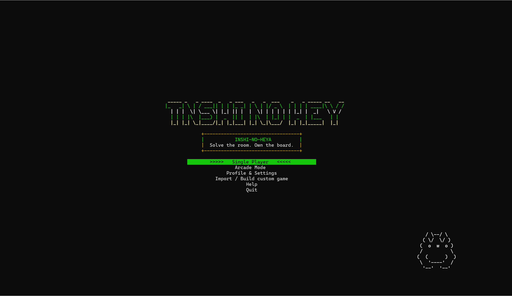

# Inshi_no_heya

**A terminal puzzle room where arithmetic, deduction, speed, and survival all share the same grid.**

## About the Game

Inshi_no_heya is a PC terminal puzzle-strategy game inspired by room-based logic puzzles. Each board is divided into numbered rooms, and every room has a product clue. Your objective is to fill the grid with valid numbers while satisfying row rules, column rules, and every room's multiplication clue. The game expands the core puzzle with arcade challenges, Ghost AI races, custom room building, save-code import/export, music, achievements, themes, and companion settings.

| Detail | Description |
| --- | --- |
| Genre | Terminal puzzle / strategy |
| Story & Objective | Enter the Inshi room, solve each product-clue grid, and survive harder challenge modes. |
| Unique Mechanic | Every room is governed by a multiplication clue, so each move must satisfy both Latin-grid logic and room-product logic. |
| Target Platform | PC console: Windows, Linux, and WSL |

## Visual Preview

These screenshots show the real terminal experience, including the main menu, puzzle boards, arcade modes, result screens, and profile customization systems.

### Menu and Tutorial

| Main Menu | Animated Tutorial | Options Menu |
| --- | --- | --- |
|  |  |  |

### Puzzle Gameplay

| 5x5 Medium | Random Easy | Random Medium |
| --- | --- | --- |
|  |  |  |

| Random Hard | Random Nightmare | Random Nightmare Variant |
| --- | --- | --- |
|  |  |  |

### Arcade and Challenge Modes

| Arcade Menu | Arcade Menu Variant | Arcade Run |
| --- | --- | --- |
|  |  |  |

| Puzzle Sprint |
| --- |
|  |

### Profile, Theme, Pet, and Music Systems

| Theme Settings | Pet Settings | Music Settings |
| --- | --- | --- |
|  |  |  |

| Language Settings | Achievements Settings |
| --- | --- |
|  |  |

### Results and End States

| Result Summary | Player Win | Player Lose |
| --- | --- | --- |
|  |  |  |

## Key Features

- **Product-room deduction gameplay**: Solve grids by matching each room's product clue while avoiding row, column, and room conflicts.
- **Multiple game modes**: Play fixed rooms, random rooms, Arcade Mode, Time Attack vs Ghost AI, and Puzzle Sprint.
- **Custom game support**: Build your own room layout or import/export a compact save code to continue or share a puzzle.
- **Profile and progression**: Track total wins, best score, achievements, input mode, theme, language, companion, music volume, and current track.
- **Terminal-first presentation**: Color themes, animated UI frames, companion dialogue, music playback, and responsive compact rendering for smaller terminals.

## Signature Systems

These are the features that make the project more than a basic C puzzle program:

- **Theme change system**: The player can cycle through five visual identities: Cyberpunk & Sci-Fi, Fantasy & RPG, Horror & Survival, Steampunk & Invention, and Biopunk & Organic Horror. The selected theme affects terminal colors and the overall mood of the interface.
- **Companion / pet system**: The profile menu lets the player choose `None`, `Chiikawa`, `Hachiware`, `Usagi`, or `Momonga`. Companions appear in the UI, have preview states, and provide contextual dialogue while the player thinks through the puzzle.
- **Ghost AI challenge modes**: Time Attack and Puzzle Sprint are not just passive timers. A Ghost AI solves alongside the player, creating pressure and replay value.
- **Music player integration**: The game supports background music, track switching, volume hotkeys, victory music, and a hidden victory track.
- **Multilingual UI settings**: The game includes language support for English, Traditional Chinese, Simplified Chinese, and Japanese UI text.
- **Exportable puzzle state**: A run can be saved into a compact text code and imported later, making it easy to continue, test, or share custom boards.
- **Custom room builder**: Players can build their own Inshi-no-heya puzzles by defining board size, room layout, and solution values.
- **Achievement and scoring layer**: The game rewards special clears such as no-hint wins, speed clears, hard clears, boss clears, comeback clears, and high-score mastery.

## Why This Project Stands Out

Inshi_no_heya combines puzzle design, systems programming, and terminal UI work in one C project. The game includes a full playable loop, persistent player data, custom puzzle serialization, multiple challenge modes, animated screens, audio handling, localization, visual themes, and companion feedback. This makes it closer to a complete console game than a simple algorithm demo.

## How to Play

The goal is to fill every empty cell with a number from `1` to the board size. A solved board must satisfy all of these rules:

- No repeated value in the same row.
- No repeated value in the same column.
- Every room's filled values multiply to the room's product clue.
- Locked starting cells cannot be changed.

### Controls

| Action | New Control Mode | Old Command Mode |
| --- | --- | --- |
| Move cursor | `WASD` or Arrow Keys | Type commands manually |
| Fill selected cell | `1` to `9` | `row col value`, for example `2 3 5` |
| Clear selected cell | `0` | `clear row col`, or use clear command flow |
| Request hint | `H` | `hint` or `idk` |
| Check board | `C` | `check` |
| Open options | `O` | `option` |
| Quit current game | `Q` or `Esc` | `exit` |
| Menu navigation | `W/S`, Arrow Keys, `Enter` | Same |
| Music hotkeys | `+` / `-` volume, `N` next, `P` previous | Same |

You can switch between input modes in **Profile & Settings** or from the in-game options menu.

## Game Modes

- **Single Player**: Play fixed or randomly generated rooms at different sizes and difficulties.
- **Arcade Mode**: Choose board size, difficulty, and AI settings for challenge-style runs.
- **Time Attack vs Ghost AI**: Race an AI opponent on the same puzzle.
- **Puzzle Sprint**: Clear a sequence of puzzles against Ghost AI pressure.
- **Import / Build Custom Game**: Paste an exported save code or build a custom room layout.

## Main Game Functions

| System | What it does |
| --- | --- |
| Board generation | Creates fixed or random product-room puzzles up to `9x9`. |
| Room logic | Tracks room IDs, room labels, products, row conflicts, column conflicts, and product conflicts. |
| Hint system | Reveals useful deductions progressively, including conflict-aware hints and direct cell hints. |
| Scoring | Rewards larger boards, faster clears, fewer hints, remaining hearts, and harder modes. |
| Achievements | Unlocks milestones such as first win, no-hint win, speed clears, hard clears, boss clears, and score mastery. |
| Theme system | Cycles the game through Cyberpunk, Fantasy, Horror, Steampunk, and Biopunk presentation styles. |
| Pet system | Lets the player choose a companion that appears in profile preview and gives in-game dialogue. |
| Ghost AI | Fills its own board during Time Attack and Puzzle Sprint modes, with selectable AI difficulty. |
| Save/import/export | Encodes the current puzzle state into a short text code that can be pasted back into the game later. |
| Custom room builder | Lets players define board size, solution values, and room layout from inside the terminal. |
| Profile settings | Stores wins, best score, achievements, input mode, theme, music, companion, and language. |
| Audio and UI | Supports background tracks, victory music, terminal color themes, animations, compact layout, and companion dialogue. |

## Prerequisites

### Windows

- Windows 10 or later is recommended.
- Use the included `Inshi_no_heya.exe` for the simplest launch path.
- Keep the `Music/` folder beside the executable if you want music playback.

### Linux / WSL

Required:

- `gcc`
- A terminal that supports ANSI escape sequences

Optional for music playback:

- `mpg123`
- `ffplay` from FFmpeg

Install common dependencies on Debian/Ubuntu/WSL:

```bash
sudo apt update
sudo apt install build-essential mpg123 ffmpeg
```

### Building a Windows `.exe` from Linux / WSL

Optional cross-compiler:

```bash
sudo apt install mingw-w64
```

## Installation

Clone the repository:

```bash
git clone https://github.com/halliana-maker/Inshi_no_heya.git
cd Inshi_no_heya
```

Replace `REPOSITORY_URL` with your actual Git repository URL. If you downloaded the project as a zip file, extract it and open a terminal inside the project folder.

## Running the Game

### Windows executable

Run:

```powershell
.\Inshi_no_heya.exe
```

### Linux / WSL executable

Run:

```bash
./Inshi_no_heya
```

If the executable bit is missing:

```bash
chmod +x Inshi_no_heya
./Inshi_no_heya
```

## Building from Source

The source is split into a small main entry file plus implementation parts:

- `Inshi_no_heya.c`
- `Inshi_no_heya_part1.c`
- `Inshi_no_heya_part2.c`
- `Inshi_no_heya_part3.c`
- `Inshi_no_heya_part4.c`

Build for Linux / WSL:

```bash
gcc -O2 Inshi_no_heya.c -o Inshi_no_heya
```

Build a 64-bit Windows executable from Linux / WSL:

```bash
x86_64-w64-mingw32-gcc -O2 Inshi_no_heya.c -o Inshi_no_heya.exe
```

## Project Structure

```text
Inshi_no_heya/
├── Inshi_no_heya.c              # Main entry point
├── Inshi_no_heya_part1.c        # Shared setup, platform, audio, UI helpers, localization
├── Inshi_no_heya_part2.c        # Theme/UI rendering, stats, scoring, achievements, puzzle checks
├── Inshi_no_heya_part3.c        # Puzzle generation/import/export, menus, single-player loop
├── Inshi_no_heya_part4.c        # Sprint, mode menus, custom room builder, profile/settings
├── Inshi_no_heya.exe            # Windows console executable
├── Inshi_no_heya                # Linux / WSL executable
├── Inshi_no_heya_all_in_one.c   # Preserved original all-in-one source
├── Inshi_no_heya_all_in_one     # Preserved original executable
├── docs/images/                 # README preview images
├── inshi_stats.txt              # Local player stats/settings
└── Music/                       # Music tracks used by the game
```

## Save Data

The game stores local stats and settings in:

```text
inshi_stats.txt
```

This file records progress such as wins, best score, achievements, selected theme, music settings, companion, and language.

## Target Platform

- Primary: **PC terminal / console**
- Supported builds: **Windows `.exe`**, **Linux**, and **WSL**

## Credits

Created as a C terminal game project for Inshi-no-heya style puzzle play, featuring custom gameplay modes, terminal UI effects, music integration, and local progression.
